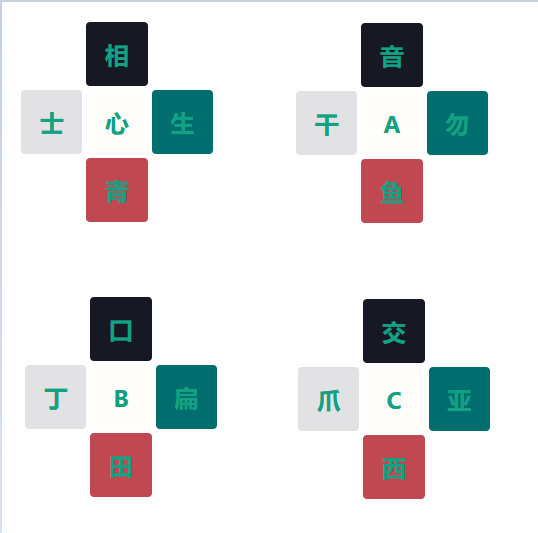
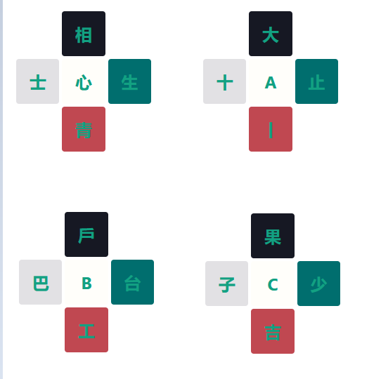
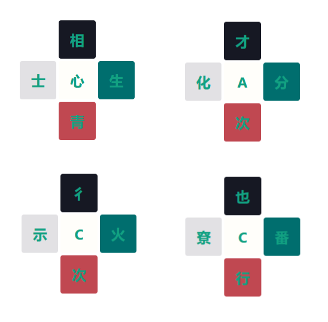

# 拼字小游戏

这个程序生成如下拼汉字小游戏

# 用法

## 生成题目
`python pinzi.py`

## 控制数量

`rets = build_questions(cnt=4,cz_lib=cz_lib)`
修改 build_questions 的 cnt 就行。

## 找答案

`find_solutions("相生青士",cz_lib)`

## 生成题目图案

1. 打开 pinzi.html

2. 在路径后面加上这些参数
`?p0=C&p1=安&p2=广&p3=京&p4=曰&color=12a182&background_color0=fffefa&background_color1=161823&background_color2=006E6E&background_color3=c04851&background_color4=e2e1e4`

p0-p4 是 5 个文字
color 是文字颜色
background_color0 是每个文字的背景色。

